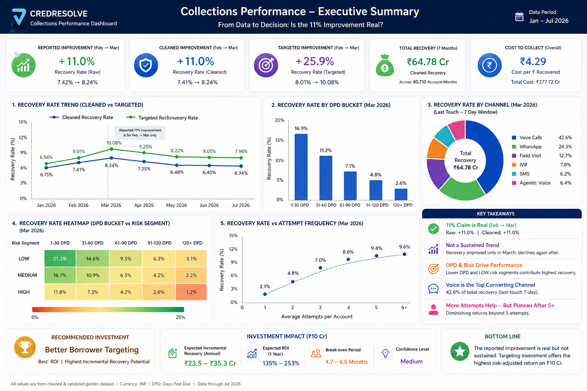

<h1 align="center"> CredResolve Collections Analytics - Forensic Data Analyst Assignment
</h1>
<p align="center">
  
</p>

## Executive answer

**The reported “Recovery improved by 11% MoM” is numerically correct for February → March 2026, but it is not evidence of a sustained operational improvement.** Raw successful-payment recovery rises **10.99%**; after payment-ID deduplication it rises **11.03%**. On a more defensible targeted-exposure denominator, recovery rate rises **25.86%** and the February-mix-adjusted change is **26.17%**. However, Jan-Jul recovery shows no sustained trend (p=0.89), and April reverses part of the March spike.

### Decision

If leadership must choose one ₹10 Cr area, **Better Borrower Targeting** is the best candidate, but the spend should be stage-gated behind a randomized holdout. The current priority field is not monotonic with recovery and therefore has optimization headroom. A one-year ₹10 Cr investment needs roughly **0.43 percentage points** incremental recovery on annualized targeted exposure merely to break even; the supplied observational data does not prove that lift yet.

## Most important forensic findings

- Event-level `borrower_id` conflicts with the account master in about **98%** of core event rows. `account_id` is therefore the stable source-of-truth key.
- `payments.csv` contains **486 exact duplicate rows** and 500 duplicated payment IDs; deduplication removes material rupee inflation but does **not** explain the Feb→Mar 11% increase.
- `calls.csv` contains **1,271 exact duplicate rows** and WhatsApp contains **600 exact duplicates.
- `15,354` borrower master rows have `updated_at < created_at`; `30,191` status-history rows have `recorded_at < event_at`.
- The supplied event history is **Jan 1-Aug 8, 2026**, not a complete 12 months. August is partial and excluded from trend conclusions.
- Payment references repeat across different accounts/amounts, so `payment_reference` is not a safe universal dedupe key.

## Repository map

```text
.
├── data/
│   ├── raw/                 # supplied 17 relational datasets + dictionary
│   └── golden/              # reconciled account-month analytical layer + outputs
├── sql/                     # staging → cleaning → golden → metrics → forensics
├── notebooks/               # executed reasoning notebook
├── dashboard/               # one-screen interactive Plotly HTML dashboard
├── reports/
│   ├── charts/              # seaborn/matplotlib figures
│   ├── Full_Analysis_Report.docx
│   └── Executive_Memo.pdf
├── architecture/            # production analytics architecture
├── src/                     # documented pipeline rules
└── README.md
```

## KPI definitions used

| KPI | Independent definition |
|---|---|
| Recovery | Sum of deduped `SUCCESS` payments only |
| Targeted recovery rate | Recovery from targeted accounts / outstanding exposure of unique targeted accounts |
| Contact rate | Answered calls / deduped calls |
| RPC rate | Right-party dispositions / calls with a disposition |
| PTP rate | PTP dispositions / RPC dispositions |
| PTP kept | KEPT / (KEPT + BROKEN) for promises due by cutoff |
| Recovery/account | Recovery / unique targeted accounts |
| Recovery/agent-hour | Portfolio recovery / valid logged session hours (proxy; payment has no agent owner) |
| Channel conversion | Last meaningful touch within 7 days before successful payment / meaningful touches |
| Cost per ₹ recovered | **Not directly measurable** from supplied data because channel/agent/telephony cost data is absent |

## Evidence labels

- **Fact** - directly reproducible from supplied data.
- **Strong Evidence** - robust after cleaning/normalization but not randomized causal proof.
- **Correlation** - association that may be confounded.
- **Hypothesis** - requires an experiment or additional data.

## How to run

```bash
pip install -r requirements.txt
jupyter notebook notebooks/collections_forensic_analysis.ipynb
```

For SQL, DuckDB is the easiest local engine:

```bash
duckdb collections.duckdb
.read sql/01_staging/01_source_views.sql
.read sql/02_cleaning/01_clean_payments.sql
.read sql/02_cleaning/02_entity_resolution.sql
.read sql/03_golden/01_golden_account_month.sql
.read sql/04_metrics/01_recovery_metrics.sql
```

Open `dashboard/executive_dashboard.html` in a browser for hoverable values and the 60-second CEO view.

## Submission note

The data is synthetic and intentionally contradictory. The project deliberately avoids fabricating a causal targeting effect where the files do not contain a clean treatment assignment. The proposed randomized holdout is therefore part of the analytical recommendation, not a limitation hidden from leadership.
